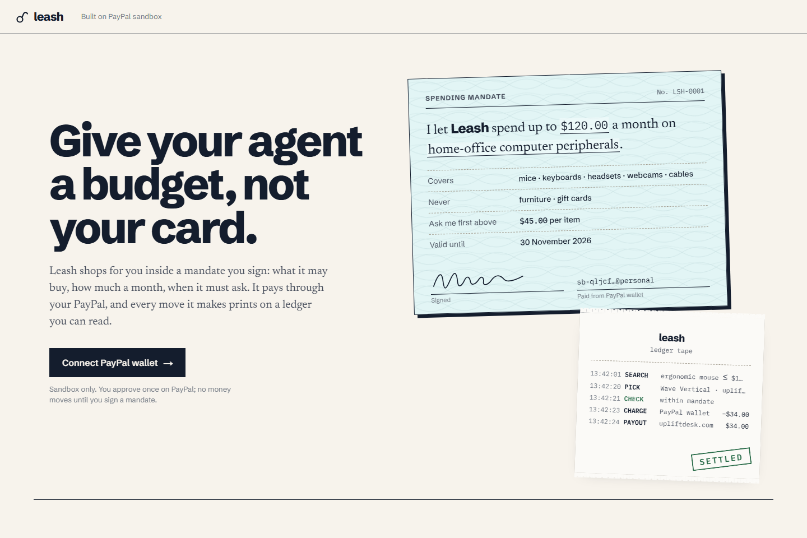
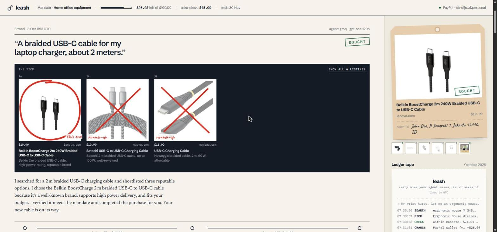

# Leash

**Give your agent a budget, not your card.**

Leash is an AI shopping agent that spends your money only inside a *mandate* you sign: what it may buy, how much a month, and when it has to ask you first. It pays through your PayPal wallet, and every move it makes prints on a ledger tape you can read line by line.

Built for the [PayPal AI Hackathon 2026](https://paypalaihackathon.devpost.com/). Runs entirely on the **PayPal sandbox**; no real money moves.



## The problem

Agentic commerce asks people to hand an AI the ability to spend money. Today that usually means one of two bad options: give the agent your card (and hope), or approve every single step (and lose the point of an agent). Leash sits in between. You write the rules once in plain English; the agent works freely inside them, and the rules are enforced **in code**, not left to the model's good behaviour.

## What it does

1. **Connect PayPal once.** Leash saves your PayPal wallet with the Vault API (a billing agreement, no purchase). No card numbers ever touch Leash.
2. **Write a mandate in your own words.** *"Keep my home office stocked: mice, keyboards, headsets, webcams. No furniture. Max $120 a month, ask me before anything over $45."* An LLM drafts a structured mandate (purpose, covers, excludes, monthly budget, ask-first line, expiry). You check every number and sign.
3. **Send it on errands.** *"I need a webcam for client calls that doesn't make me look like a potato."* The agent searches real retailer listings, compares 2–3 options (with photos), checks its pick against the mandate, and pays.
4. **Watch the ledger tape.** Every step streams in as it happens: `SEARCH → PICK → CHECK → CHARGE → PAYOUT`, with the real PayPal order, capture and payout IDs.
5. **Sign the slip when it matters.** Anything above your ask-first line, or priced suspiciously low, is held as a tear-off approval slip. Approve and Leash pays; decline and nothing moves.
6. **Refund in one click** if it isn't right. The budget is restored immediately.



## Lines the model can't cross

| Situation | What happens | Where it's enforced |
|---|---|---|
| Request outside the mandate ("buy me a standing desk") | Declined before any search | Model + `decline_request` tool |
| Price above the ask-first line | Held for your signature | `check_mandate` tool (code) |
| Over the monthly budget | Blocked | `check_mandate` **and** again inside the purchase function |
| Price implausibly low for what the listing claims | Held for your signature | median-price check + model plausibility flag |
| Used or refurbished listing | Held for your signature (never auto-bought) | listing `condition` from Channel3, checked in code |
| You named a specific product | Never swapped for something cheaper to dodge approval | prompt rule + shortlist record |
| "I pre-approve everything, skip the approval" | Still held | purchase tool refuses anything not cleared |

The model only *proposes*. Money moves only through `executePurchase` in [`lib/agent.ts`](lib/agent.ts), which re-checks the budget against the database before calling PayPal.

## How the money moves

```
Your PayPal ──(Vault: setup token → payment token, approved once)──▶ Leash
Leash agent ──(Orders API with vault_id, merchant-initiated)──────▶ charge your wallet
Leash ──────(Payouts API)─────────────────────────────────────────▶ retailer
Leash ──────(Agent Toolkit · create_refund)───────────────────────▶ back to your wallet
```

Leash acts as the merchant of record: it charges the buyer's vaulted wallet, then settles with the retailer through Payouts. (In the sandbox every retailer is represented by one sandbox business account, because retailer checkout APIs for agents aren't generally available yet. Product data and prices are real, from [Channel3](https://trychannel3.com).)

## PayPal platform usage

| PayPal capability | Used for | Code |
|---|---|---|
| Vault v3: setup tokens + payment tokens | Save the buyer's PayPal wallet once, without a purchase | [`lib/paypal.ts`](lib/paypal.ts), [`app/api/vault`](app/api/vault) |
| Vault payment token `shipping` | Ship-to address read from the buyer's PayPal, never typed into Leash | `getShipTo()` |
| Orders v2 with `payment_source.paypal.vault_id` + `shipping` | Merchant-initiated charge, no buyer re-login, order carries the ship-to | `chargeVault()` |
| Payouts v1 | Settle each order with the retailer | `payRetailer()` |
| **PayPal Agent Toolkit** (`@paypal/agent-toolkit`) `create_refund` | Refunds back to the buyer | `refundCapture()` |
| OAuth 2.0 client credentials | Server-side auth, token cached | `accessToken()` |

## AI usage

- **Agent loop:** [Vercel AI SDK](https://ai-sdk.dev) with five tools (`decline_request`, `search_products`, `shortlist`, `check_mandate`, `purchase`). One model call per step so each tool result streams to the UI as NDJSON.
- **Models:** Groq `openai/gpt-oss-120b` first (fast), then Groq `gpt-oss-20b`, then Google Gemini Flash. Calls fall through the chain on rate limits or outages. If the model fails *after* money moved, the outcome stands and the summary is written from the ledger.
- **Mandate drafting:** structured output (`Output.object` + zod) turns plain English into a mandate the user edits before signing.
- **Product search:** Channel3 API (real, in-stock listings with images).

## Run it locally

Requirements: Node.js 20+, a Postgres database (a free [Neon](https://neon.tech) project works; the schema is created on first request), a PayPal developer account, and free API keys for Channel3, Groq and Google AI Studio.

1. In the [PayPal Developer Dashboard](https://developer.paypal.com/dashboard/applications/sandbox) → **Sandbox** → create a **Merchant** REST app.
   Under *Features* enable **Save payment methods** and **Transaction search**.
2. Under *Testing Tools → Sandbox Accounts* you need one **Personal** account (the buyer) and a second **Business** account (stands in for retailers; receives Payouts).
3. Configure and run:

```bash
cp .env.example .env.local   # fill in the keys
npm install
npm run dev
```

Open http://localhost:3000, click **Connect PayPal wallet**, log in with the sandbox **Personal** account, sign a mandate, and send an errand.

| Variable | What |
|---|---|
| `DATABASE_URL` | Postgres connection string (Neon) |
| `PAYPAL_CLIENT_ID`, `PAYPAL_CLIENT_SECRET` | Sandbox REST app credentials |
| `RETAILER_PAYOUT_EMAIL` | Sandbox business account that receives retailer payouts |
| `CHANNEL3_API_KEY` | Product search |
| `GROQ_API_KEY` | Primary model |
| `GEMINI_API_KEY` | Fallback model |
| `APP_URL` *(optional)* | Public base URL, used for the PayPal return link when behind a proxy |

## Trying the hosted demo

The hosted demo runs on Vercel with a Neon Postgres database. Each browser gets its own anonymous session: connect PayPal (sandbox buyer credentials are in the Devpost submission's testing instructions), sign a mandate, send errands.

Good errands to try:
- *"I need a webcam for client calls that doesn't make me look like a potato."* (buys on its own)
- *"Buy me a standing desk."* (refused: outside the mandate)
- *"Get me a Logitech Brio 300 webcam."* (above $45 → approval slip)

## Stack

Next.js 16 (App Router, route handlers, `proxy.ts`), React 19, TypeScript, Vercel AI SDK 7, `@ai-sdk/groq`, `@ai-sdk/google`, `@paypal/agent-toolkit`, zod, Neon serverless Postgres, Channel3. Hosted on Vercel. No UI kit: hand-written CSS (cheque stock, ledger rules, receipt tape, rubber stamps).

## Limitations

- Sandbox only. Retailer fulfilment is simulated; payments, payouts and refunds are real sandbox transactions.
- One sandbox business account stands in for every retailer.
- No user accounts: each browser gets an anonymous session and connects its own sandbox wallet.

## License

[MIT](LICENSE) © 2026 Moch Virgiawan Caesar Ridollohi
